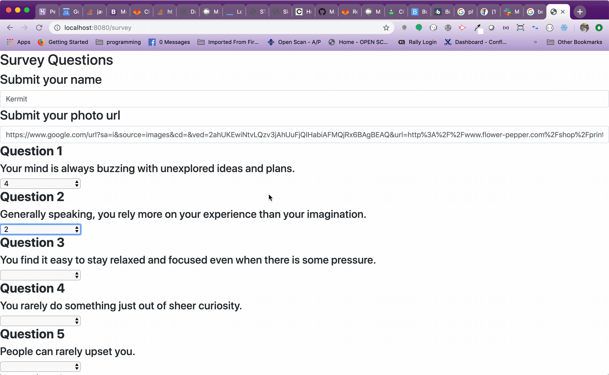

# friendfindergg
Friend Finder is a friend matching application built on a Node / Express backend that uses an API to push data to a primarily HTML javascript front end. It's function is to match visitors to the site with friends in the friend finder data set.

Welcome to Friend Finder

By entering your personal information

and taking the survey, you are matched with your most compatible friend

Enjoy Friendship!!!!

